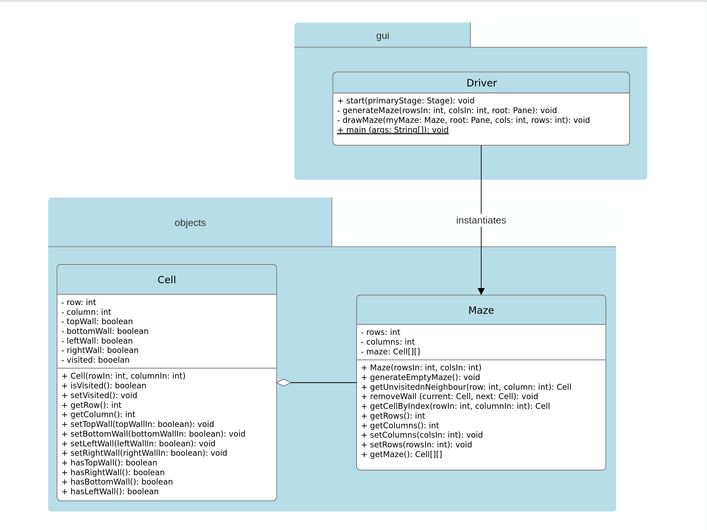

# Maze-generator
Computer app which generates random solvable mazes
 
# Launch instructions
1. Clone the repository
```bash
git clone https://github.com/Sergey-Mr/Maze-generator.git
```
2. Navigate to the root folder:
```bash
cd Maze-generator/
```
3. Compile the application:

```bash
javac src/objects/*.java
javac --module-path lib --add-modules javafx.controls,javafx.fxml src/gui/Driver.java
```
4. Run it:
```bash
java --module-path lib --add-modules javafx.controls,javafx.fxml src.gui.Driver
```

# UML Class Diagram


# Directory strucutre
Maze-generator<br>
│<br>
├── lib<br>
│   ├── javafx.controls<br>
│   └── javafx.fxml<br>
│<br>
├── src<br>
│   ├── gui<br>
│   │   └── Driver.java<br>
│   └── objects<br>
│       └── Cell.java<br>
│       └── Maze.java<br>
│<br>
├── images<br>
│   └── UML-class-diagram.png<br>
│<br>
└── README.md<br>
